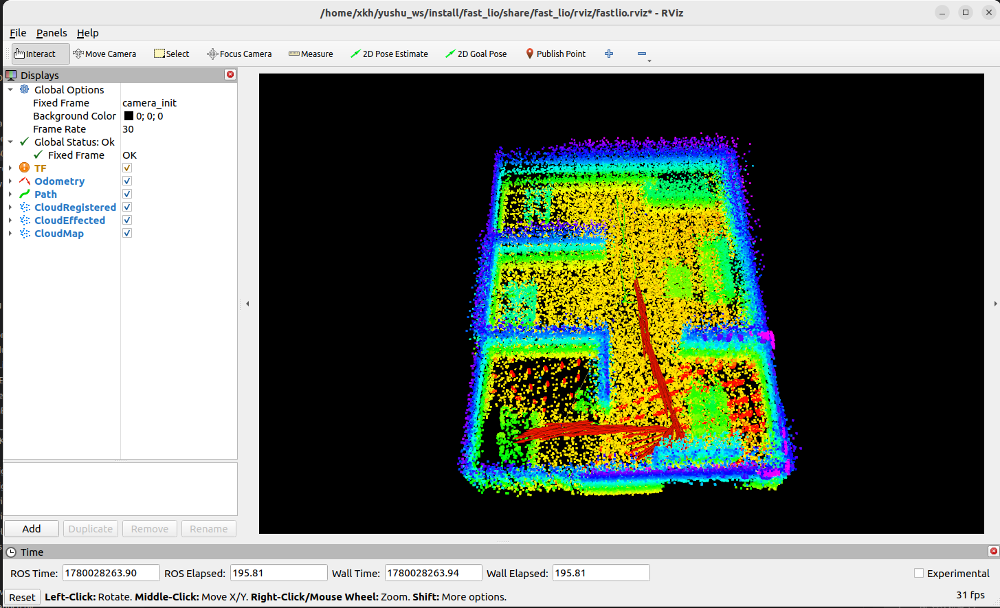
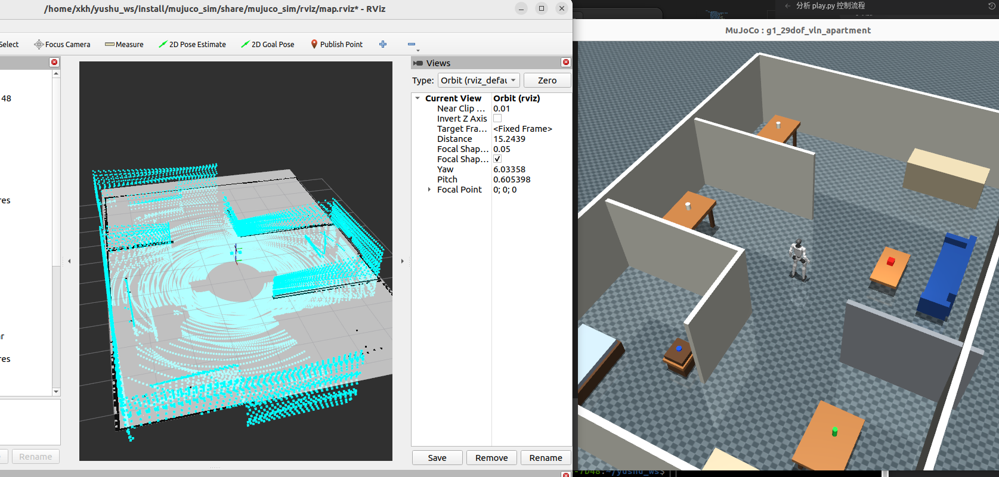
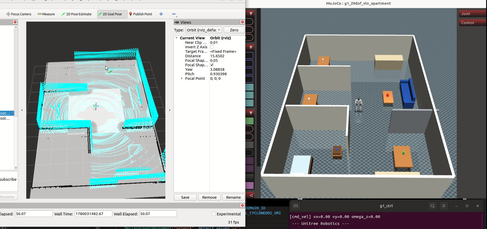

# G1 MuJoCo ROS2 Navigation Simulation

This workspace integrates Unitree G1 MuJoCo simulation, MJLab policy deployment, ROS2 Navigation, 2D SLAM, and Mid360 / FAST-LIO mapping into one reproducible workflow. The goal is to validate navigation, perception, and locomotion policies in MuJoCo before moving toward a real G1 robot.

It is strongly recommended to clone and use this complete workspace directly instead of re-cloning each upstream repository and manually stitching them together. This project contains small compatibility changes to Unitree, MJLab, FAST-LIO, Livox, and related packages. Using the full workspace avoids many version and interface mismatches.

## Features

- Start Unitree G1 MuJoCo simulation with `unitree_mujoco`.
- Deploy and run the G1 locomotion policy with `unitree_rl_mjlab/deploy/robots/g1/g1_ctrl`.
- Control the G1 from Nav2 `/cmd_vel`.
- Publish MuJoCo data to ROS2 through a bridge:
  - `/scan`
  - `/livox/lidar`
  - `/imu/data`
  - `/odom`
  - `/tf`
- Simulate a Livox Mid360 point cloud sensor mounted on the G1 head.
- Build 2D maps with `slam_toolbox`.
- Run 3D PCD mapping and localization experiments with `FAST_LIO_ROS2`.
- Run Nav2 navigation with saved 2D `.yaml/.pgm` maps.

## Data Flow

```text
Nav2 goal
  -> Nav2 planner/controller
  -> /cmd_vel
  -> g1_ctrl --cmd_vel
  -> MJLab / Unitree walking policy
  -> Unitree MuJoCo robot motion
  -> shared memory
  -> mujuco_sim bridge
  -> /scan /livox/lidar /imu/data /tf
  -> SLAM / FAST-LIO / Nav2 / RViz
```

## Workspace Layout

After creating a workspace and cloning this repository, the `src` directory should look similar to this:

```text
src/
  FAST_LIO_ROS2
  Livox-SDK2
  lidar_localization_ros2
  livox_ros_driver2
  maps
  mujuco_sim
  unitree_mujoco
  unitree_rl_mjlab
  unitree_ros2
  unitree_sdk2
```

Main directories:

```text
src/mujuco_sim/              # ROS2 launch files and MuJoCo-ROS bridge nodes
src/unitree_mujoco/          # Unitree MuJoCo simulator with nav shared memory and Mid360 simulation
src/unitree_rl_mjlab/        # MJLab G1 policy deployment and g1_ctrl
src/FAST_LIO_ROS2/           # FAST-LIO2 ROS2 package
src/Livox-SDK2/              # Livox SDK2 dependency
src/livox_ros_driver2/       # Livox ROS2 driver, mainly for real robot use
src/unitree_sdk2/            # Unitree SDK2
src/unitree_ros2/            # Unitree ROS2 examples and interfaces
src/maps/                    # 2D maps and saved PCD maps
```

## Modified Upstream Files

If you do not clone this complete workspace and instead download upstream repositories manually, at least these changes need to be carried over:

- `src/unitree_mujoco/simulate/src/main.cc`
  - Connects the navigation shared-memory bridge.
- `src/unitree_mujoco/simulate/src/shm_nav_bridge.cc`
  - Generates shared-memory data for `/scan`, Mid360 point cloud, IMU, and robot pose from MuJoCo.
- `src/unitree_mujoco/simulate/src/shm_nav_bridge.h`
  - Defines the shared-memory data structure.
- `src/unitree_mujoco/simulate/config/mid360_pattern.csv`
  - Simulated Mid360 scan pattern.
- `src/unitree_mujoco/simulate/config.yaml`
  - Selects the current simulation scene.
- `src/unitree_mujoco/unitree_robots/g1/*.xml`
  - G1 navigation scenes, VLN rooms, LiDAR site, and related MuJoCo XML changes.
- `src/unitree_mujoco/example/COLCON_IGNORE`
  - Avoids duplicate `stand_go2` package names during colcon builds.
- `src/unitree_rl_mjlab/deploy/robots/g1/main.cpp`
  - Adds keyboard, default, and `/cmd_vel` control modes.
- `src/unitree_rl_mjlab/deploy/include/input/velocity_command_source.h`
  - Unifies velocity command sources.
- `src/unitree_rl_mjlab/deploy/include/param.h`
  - Deployment parameter adaptations.
- `src/FAST_LIO_ROS2/config/mid360.yaml`
  - FAST-LIO config for simulated Mid360 plus MuJoCo IMU.
- `src/FAST_LIO_ROS2/config/mid360_real.yaml`
  - FAST-LIO config for real Mid360 experiments.
- `src/FAST_LIO_ROS2/src/laserMapping.cpp`
  - Adds the `/map_save` service for manual PCD saving.
  - The `foxy` branch includes ROS2 Foxy service callback compatibility changes.
- `src/mujuco_sim/`
  - New ROS2 package containing launch files, Nav2 params, RViz config, MuJoCo shared-memory bridge, and FAST-LIO TF bridge.

For this reason, the recommended path is to use the complete workspace from this repository. If you use upstream repositories directly, replace the files above with this repository's versions.

## Requirements

The main branch was tested mainly on Ubuntu 22.04 + ROS2 Humble. For Ubuntu 20.04 + ROS2 Foxy, use the `foxy` branch because Foxy needs extra compatibility changes for some ROS2 C++ APIs, Livox driver builds, and FAST-LIO.

Install ROS2 navigation dependencies. Humble example:

```bash
sudo apt install \
  ros-humble-navigation2 \
  ros-humble-nav2-bringup \
  ros-humble-slam-toolbox \
  ros-humble-rviz2 \
  ros-humble-tf2-ros \
  ros-humble-pcl-ros \
  ros-humble-pcl-conversions \
  ros-humble-rmw-cyclonedds-cpp
```

Foxy example:

```bash
sudo apt install \
  ros-foxy-navigation2 \
  ros-foxy-nav2-bringup \
  ros-foxy-slam-toolbox \
  ros-foxy-rviz2 \
  ros-foxy-tf2-ros \
  ros-foxy-pcl-ros \
  ros-foxy-pcl-conversions \
  ros-foxy-rmw-cyclonedds-cpp \
  libeigen3-dev \
  libpcl-dev \
  libapr1-dev \
  libpcap-dev \
  libusb-1.0-0-dev
```

`rmw_cyclonedds_cpp` is important. The launch files use CycloneDDS by default. If the package is missing, you may see an error similar to:

```text
failed to find shared library 'rmw_cyclonedds_cpp'
```

Follow Unitree official documentation to configure Unitree MuJoCo, Unitree SDK2, and Unitree RL MJLab. This project assumes that you can already run Unitree MuJoCo and the G1 `g1_ctrl` controller independently. Full workspace builds and real LiDAR workflows also require Livox-SDK2, `livox_ros_driver2`, and FAST-LIO.

## Build and Install Unitree SDK2

Both `unitree_mujoco/simulate` and `g1_ctrl` link against Unitree SDK2 and expect it installed under `/opt/unitree_robotics`. Install it from this workspace, not from the upstream Unitree repository — this workspace copy contains extra `dds_wrapper` headers that `g1_ctrl` requires:

```bash
cd ~/{your_workspace}/src/unitree_sdk2
mkdir -p build && cd build
cmake .. -DCMAKE_INSTALL_PREFIX=/opt/unitree_robotics -DBUILD_EXAMPLES=OFF
make -j4
sudo make install
```

Verify the installation:

```bash
ls /opt/unitree_robotics/lib/cmake/unitree_sdk2/unitree_sdk2Config.cmake
ls /opt/unitree_robotics/include/unitree/dds_wrapper/robots/g1/g1.h
```

If this step is skipped, building `unitree_mujoco/simulate` later fails with:

```text
Could not find a package configuration file provided by "unitree_sdk2"
```

and building `g1_ctrl` fails with:

```text
Could not find unitree_sdk2 include directory
```

If compiling the SDK fails with:

```text
fatal error: unitree/common/log/log.hpp: No such file or directory
```

your clone is missing `src/unitree_sdk2/include/unitree/common/log/`. An earlier `.gitignore` rule `log/` (meant for colcon output) accidentally excluded these headers from the repository; the rule is now anchored as `/log/`. Restore the headers from the official SDK — they are identical across upstream versions:

```bash
git clone --depth 1 https://github.com/unitreerobotics/unitree_sdk2 /tmp/unitree_sdk2_official
cp -r /tmp/unitree_sdk2_official/include/unitree/common/log \
      ~/{your_workspace}/src/unitree_sdk2/include/unitree/common/log
```

This fix is verified on Ubuntu 22.04 + GCC 11.4: after restoring the headers, the SDK installs cleanly and both `unitree_mujoco` and `g1_ctrl` build and run.

## Build Unitree MuJoCo

If building `unitree_mujoco/simulate` fails with missing MuJoCo, `glfw_adapter.h`, or `-lmujoco`, MuJoCo C/C++ SDK is not installed or not linked correctly.

Install MuJoCo 3.2.7:

```bash
mkdir -p ~/.mujoco
cd ~/.mujoco
wget https://github.com/google-deepmind/mujoco/releases/download/3.2.7/mujoco-3.2.7-linux-x86_64.tar.gz
tar -xzf mujoco-3.2.7-linux-x86_64.tar.gz
find mujoco-3.2.7 -name "glfw_adapter.h"
find mujoco-3.2.7 -name "libmujoco.so"
```

On Ubuntu 20.04 / ROS2 Foxy, if linking fails with:

```text
undefined reference to `shm_open'
```

add `rt` to `link_libraries(...)` in `src/unitree_mujoco/simulate/CMakeLists.txt`:

```cmake
link_libraries(
  pthread
  mujoco
  glfw
  yaml-cpp
  unitree_sdk2
  boost_program_options
  fmt
  rt
)
```

Then rebuild:

```bash
cd ~/{your_workspace}/src/unitree_mujoco/simulate
rm -rf build
mkdir build
cd build
cmake .. \
  -DMUJOCO_DIR=$HOME/.mujoco/mujoco-3.2.7 \
  -DCMAKE_PREFIX_PATH=$HOME/.mujoco/mujoco-3.2.7
make -j4
```

Run:

```bash
./unitree_mujoco
```

If the G1 simulation scene appears in MuJoCo, this step is working.

## Build MJLab / G1 Controller

Install build dependencies first:

```bash
sudo apt install libboost-program-options-dev libspdlog-dev libfmt-dev libeigen3-dev libyaml-cpp-dev zlib1g-dev
```

```bash
cd ~/{your_workspace}/src/unitree_rl_mjlab/deploy/robots/g1
mkdir -p build
cd build
cmake .. -DCMAKE_PREFIX_PATH=/opt/unitree_robotics
make -j4
```

`-DCMAKE_PREFIX_PATH=/opt/unitree_robotics` is required. A plain `cmake ..` fails with:

```text
Could not find unitree_sdk2 include directory
```

because `/opt/unitree_robotics` is not in CMake's default search path. See the Build and Install Unitree SDK2 section above.

Run keyboard control:

```bash
./g1_ctrl --network=lo --domain=1 --keyboard
```

If `g1_ctrl` crashes immediately after the CycloneDDS interface message with:

```text
free(): invalid pointer
Aborted (core dumped)
```

the process loaded the wrong CycloneDDS library. The binary records `/opt/unitree_robotics/lib` in its RUNPATH, but `LD_LIBRARY_PATH` has higher priority than RUNPATH. In a terminal with a sourced ROS 2 environment (or an active conda environment), ROS's own `libddsc.so.0` is loaded instead of Unitree's and corrupts the heap during DDS startup. Check the resolution with:

```bash
ldd ./g1_ctrl | grep ddsc
```

Both `libddsc.so.0` and `libddscxx.so.0` must resolve to `/opt/unitree_robotics/lib`. Either run `g1_ctrl` from a terminal without sourcing ROS 2 — it does not need ROS, it talks DDS directly — or force the correct path:

```bash
export LD_LIBRARY_PATH=/opt/unitree_robotics/lib:$LD_LIBRARY_PATH
./g1_ctrl --network=lo --domain=1 --keyboard
```

This is verified on Ubuntu 22.04: with a clean library path the same binary starts normally and reaches `Waiting for connection to robot...`. The `g1_nav_sim.launch.py` launch file prepends `/opt/unitree_robotics/lib` to `LD_LIBRARY_PATH` for the `unitree_mujoco` and `g1_ctrl` processes, so launching from a sourced ROS 2 terminal is safe.

After the controller detects the robot, click reset in the MuJoCo window. The robot should enter the FixStand / Velocity flow. Use the keyboard in the `g1_ctrl` terminal:

```text
w/s: x direction
 a/d: y direction
q/e: yaw direction
```

If the robot walks in the simulation, the basic control path is working.

## Build Livox-SDK2 and livox_ros_driver2

If you plan to use a real Mid360, or if you want to build the full workspace including Livox packages, configure Livox-SDK2 first. MuJoCo simulation itself does not require the real Livox driver because the simulated `/livox/lidar` topic is published by the `mujuco_sim` bridge.

For ROS2 Foxy, build and install Livox-SDK2:

```bash
cd ~/{your_workspace}/src/Livox-SDK2
mkdir -p build
cd build
cmake ..
make -j4
sudo make install
sudo ldconfig
```

Check the installation:

```bash
find /usr/local -name "livox_lidar_api.h"
ldconfig -p | grep livox
```

Build `livox_ros_driver2`. Upstream Livox ships the manifest as `package_ROS1.xml` / `package_ROS2.xml` and expects its `build.sh` to generate `package.xml`, and an old `.gitignore` rule in `src/livox_ros_driver2/` kept the generated file out of this repository. Without it, colcon fails with:

```text
CMake Error: File .../livox_ros_driver2/package.xml does not exist.
...
Packages installing interfaces must include
'<member_of_group>rosidl_interface_packages</member_of_group>' in their package.xml
```

The repository now ships `package.xml` (a copy of `package_ROS2.xml`) and the `.gitignore` rule has been removed. If your clone predates this fix, create the file manually:

```bash
cd ~/{your_workspace}/src/livox_ros_driver2
cp package_ROS2.xml package.xml
```

Do not run Livox's `build.sh` to fix this — it executes `rm -rf` on the workspace `build/` and `install/` directories.

ROS2 Humble build:

```bash
cd ~/{your_workspace}
source /opt/ros/humble/setup.bash
colcon build --packages-select livox_ros_driver2 \
  --cmake-args \
  -DROS_EDITION=ROS2 -DDISTRO_ROS=humble \
  -DLIVOX_LIDAR_SDK_INCLUDE_DIR=/usr/local/include \
  -DLIVOX_LIDAR_SDK_LIBRARY=/usr/local/lib/liblivox_lidar_sdk_shared.so
```

`-DDISTRO_ROS=humble` matters: on Humble/Jazzy the `CMakeLists.txt` must use the `rosidl_get_typesupport_target` code path; without this flag it falls back to the older typesupport linking that only works on Foxy-era distros.

ROS2 Foxy build:

```bash
cd ~/{your_workspace}
source /opt/ros/foxy/setup.bash
colcon build --packages-select livox_ros_driver2 \
  --cmake-args \
  -DLIVOX_LIDAR_SDK_INCLUDE_DIR=/usr/local/include \
  -DLIVOX_LIDAR_SDK_LIBRARY=/usr/local/lib/liblivox_lidar_sdk_shared.so
```

The recommended approach is still to use this complete workspace to avoid ROS distro and Livox driver compatibility issues.

## FAST-LIO Foxy Compatibility

The `foxy` branch already contains Foxy-compatible changes in `src/FAST_LIO_ROS2/src/laserMapping.cpp`. If you download FAST-LIO from upstream manually, pay attention to the `/map_save` service callback signature. Foxy should use a three-argument callback.

Recommended `create_service` code:

```cpp
map_save_srv_ = this->create_service<std_srvs::srv::Trigger>(
    "map_save",
    std::bind(
        &LaserMappingNode::map_save_callback,
        this,
        std::placeholders::_1,
        std::placeholders::_2,
        std::placeholders::_3));
```

Recommended callback code:

```cpp
void map_save_callback(
    const std::shared_ptr<rmw_request_id_t> request_header,
    const std::shared_ptr<std_srvs::srv::Trigger::Request> req,
    std::shared_ptr<std_srvs::srv::Trigger::Response> res)
{
    (void)request_header;
    (void)req;

    RCLCPP_INFO(this->get_logger(), "Saving map to %s...", map_file_path.c_str());
    if (pcd_save_en)
    {
        save_to_pcd();
        res->success = true;
        res->message = "Map saved.";
    }
    else
    {
        res->success = false;
        res->message = "Map save disabled.";
    }
}
```

Build FAST-LIO:

```bash
cd ~/{your_workspace}
source /opt/ros/{your_ros_distro}/setup.bash
colcon build --packages-select fast_lio
source install/setup.bash
ros2 pkg prefix fast_lio
```

If `ros2 pkg prefix fast_lio` prints a path, FAST-LIO is installed correctly.

## Build the Full Workspace

On a new machine, or after copying this workspace, clean old build outputs first:

```bash
cd ~/{your_workspace}
rm -rf build install log
source /opt/ros/{your_ros_distro}/setup.bash
colcon build --cmake-args -DPython3_EXECUTABLE=/usr/bin/python3
source install/setup.bash
```

On ROS2 Humble, add the Livox flags so `livox_ros_driver2` selects the right typesupport path:

```bash
colcon build --cmake-args -DPython3_EXECUTABLE=/usr/bin/python3 -DROS_EDITION=ROS2 -DDISTRO_ROS=humble
```

The workspace contains several packages that are not needed for the simulation pipeline and do not build on a plain ROS2 install. They now carry `COLCON_IGNORE` markers so the single `colcon build` command above works out of the box:

- `src/unitree_ros2/` (`unitree_api`, `unitree_go`, `unitree_hg`, `unitree_ros2_example`): real-robot ROS2 interop only. Fails with `Could not find ... "rosidl_generator_dds_idl"` because that generator comes from Unitree's `cyclonedds_ws` setup, not from a standard ROS2 install.
- `src/lidar_localization_ros2/`: experimental NDT localization, unused by all launch files. Fails with `Could not find ... "ndt_omp_ros2"`, a source-only package that would have to be cloned into `src/`.
- `src/unitree_sdk2/` and `src/Livox-SDK2/`: already installed system-wide in the earlier steps; rebuilding them inside colcon is redundant.
- `src/unitree_rl_mjlab/`: the RL training repository; the deployed `g1_ctrl` is built separately with CMake.

To re-enable a package later (for example `src/unitree_ros2` for a real robot after building Unitree's `cyclonedds_ws`, or `lidar_localization_ros2` after cloning `ndt_omp_ros2`), delete its `COLCON_IGNORE` file. If your clone predates these markers, create them:

```bash
cd ~/{your_workspace}
touch src/unitree_ros2/COLCON_IGNORE src/unitree_sdk2/COLCON_IGNORE \
      src/Livox-SDK2/COLCON_IGNORE src/unitree_rl_mjlab/COLCON_IGNORE \
      src/lidar_localization_ros2/COLCON_IGNORE
```

System (apt) dependencies of the remaining packages can be installed automatically with rosdep instead of hunting them one by one:

```bash
sudo rosdep init   # first time only
rosdep update
rosdep install --from-paths src --ignore-src -r -y
```

Note what rosdep can and cannot do here: it installs binary apt dependencies declared in `package.xml` (PCL, Nav2, tf2, ...), but it cannot provide vendor SDKs (Unitree SDK2, Livox-SDK2), source-only packages (`ndt_omp_ros2`, `rosidl_generator_dds_idl`), or fix repository issues — those are exactly what the sections above handle. The `-r` flag makes it continue past keys it cannot resolve.

rosdep is optional for this workspace: the apt list in the Requirements section already covers the simulation pipeline. If `rosdep init`/`update` times out (it downloads from `raw.githubusercontent.com`, which is unreachable in some networks), either skip rosdep entirely, or use the TUNA mirror:

```bash
sudo mkdir -p /etc/ros/rosdep/sources.list.d
sudo curl -o /etc/ros/rosdep/sources.list.d/20-default.list \
  https://mirrors.tuna.tsinghua.edu.cn/github-raw/ros/rosdistro/master/rosdep/sources.list.d/20-default.list
export ROSDISTRO_INDEX_URL=https://mirrors.tuna.tsinghua.edu.cn/rosdistro/index-v4.yaml
rosdep update
```

Add the `export ROSDISTRO_INDEX_URL=...` line to `~/.bashrc` so later `rosdep update` calls also use the mirror.

The launch files no longer contain a hard-coded workspace path: `WS_SRC` is derived automatically from the `mujuco_sim` install prefix (`<ws>/install/mujuco_sim` → `<ws>/src`), so the workspace can live in any directory under any name. Only for nonstandard layouts (for example `--merge-install`) set an explicit override:

```bash
export G1_WS_SRC=~/{your_workspace}/src
```

If you edit any launch file, rebuild and source afterwards:

```bash
cd ~/{your_workspace}
colcon build --packages-select mujuco_sim
source install/setup.bash
```

If you see a duplicate `stand_go2` package error, make sure this file exists:

```text
src/unitree_mujoco/example/COLCON_IGNORE
```

If launch logs still reference an old workspace (for example a stale `.../old_ws/install` path), the shell environment is polluted by an old workspace. Open a new terminal or run:

```bash
unset AMENT_PREFIX_PATH
unset CMAKE_PREFIX_PATH
unset COLCON_PREFIX_PATH
source /opt/ros/{your_ros_distro}/setup.bash
source ~/{your_workspace}/install/setup.bash
```

Also check `~/.bashrc` and avoid automatically sourcing an old workspace.

## Run MuJoCo + G1 Control

Keyboard control mode:

```bash
cd ~/{your_workspace}
source /opt/ros/{your_ros_distro}/setup.bash
source install/setup.bash
ros2 launch mujuco_sim g1_nav_sim.launch.py input:=keyboard
```

Nav2 `/cmd_vel` control mode:

```bash
ros2 launch mujuco_sim g1_nav_sim.launch.py input:=cmd_vel
```

Useful checks:

```bash
ros2 topic list
ros2 topic hz /scan
ros2 topic hz /livox/lidar
ros2 topic hz /imu/data
ros2 run tf2_ros tf2_echo base_link livox_frame
```

## 2D Mapping With slam_toolbox

Edit the top of `src/mujuco_sim/launch/map.launch.py`:

```python
MODE = "sim"
USE_SLAM_TOOLBOX_2D = True
```

Start mapping:

```bash
cd ~/{your_workspace}
source /opt/ros/{your_ros_distro}/setup.bash
source install/setup.bash
ros2 launch mujuco_sim map.launch.py
```

Drive the robot with the keyboard controller, then save the 2D map:

```bash
ros2 run nav2_map_server map_saver_cli -f ~/{your_workspace}/src/maps/new_2d_map
```

## FAST-LIO PCD Mapping

Edit the top of `src/mujuco_sim/launch/map.launch.py`:

```python
MODE = "sim"
USE_SLAM_TOOLBOX_2D = False
```

Start FAST-LIO mapping:

```bash
cd ~/{your_workspace}
source /opt/ros/{your_ros_distro}/setup.bash
source install/setup.bash
ros2 launch mujuco_sim map.launch.py
```

Drive the robot around the environment. Do not rely on `Ctrl+C` to save the PCD. Explicitly call the save service:

```bash
ros2 service call /map_save std_srvs/srv/Trigger {}
```

The simulated FAST-LIO PCD output path is configured in:

```text
src/FAST_LIO_ROS2/config/mid360.yaml
```

By default it saves to:

```text
./src/maps/vln_fastlio_map.pcd
```

Example FAST-LIO 3D PCD mapping result:



## Navigation

Make sure `src/mujuco_sim/launch/nav.launch.py` points to the desired 2D map. The default map is:

```text
src/maps/vln_navigation_room.yaml
```

Start navigation:

```bash
cd ~/{your_workspace}
source /opt/ros/{your_ros_distro}/setup.bash
source install/setup.bash
ros2 launch mujuco_sim nav.launch.py
```

Send a `2D Goal Pose` in RViz. Nav2 publishes `/cmd_vel`, and `g1_ctrl --cmd_vel` receives it to drive the G1 in MuJoCo.

Example Nav2 simulation results:





## Real Robot Notes

For a real G1 robot:

1. Configure Unitree network, SDK2, and ROS2 according to Unitree official documentation.
2. Start the real Mid360 driver and confirm that `/livox/lidar` exists.
3. If you want to build a 2D map with `slam_toolbox`, convert Mid360 `PointCloud2` to `/scan` with `pointcloud_to_laserscan`.
4. Save the `.yaml/.pgm` map and use it with Nav2.
5. Run `g1_ctrl` on the real robot network interface, for example:

```bash
cd ~/{your_workspace}/src/unitree_rl_mjlab/deploy/robots/g1/build
./g1_ctrl --network=enp5s0
```

Validate keyboard control and policy deployment first, then switch to `/cmd_vel` mode for Nav2 integration.

## Launch Files

- `g1_nav_sim.launch.py`: starts Unitree MuJoCo, `g1_ctrl`, and the shared-memory ROS2 bridge.
- `map.launch.py`: starts mapping; switch between 2D `slam_toolbox` and FAST-LIO PCD mapping at the top of the file.
- `nav.launch.py`: starts simulation, FAST-LIO localization bridge, Nav2, and RViz.

## DDS Notes

Simulation defaults to `ROS_DOMAIN_ID=1` and uses CycloneDDS loopback config:

```text
src/mujuco_sim/config/cyclonedds_lo.xml
```

The launch files set these environment variables automatically. If `rmw_cyclonedds_cpp` is missing, install the package for your ROS distro:

```bash
sudo apt install ros-foxy-rmw-cyclonedds-cpp
# or
sudo apt install ros-humble-rmw-cyclonedds-cpp
```
